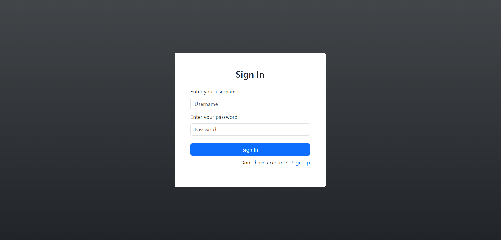
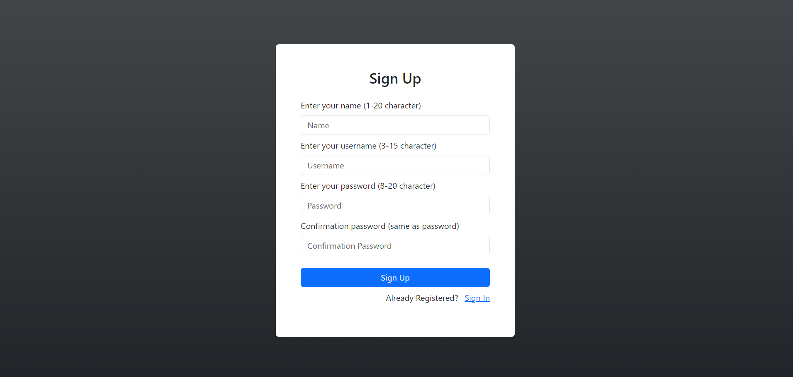
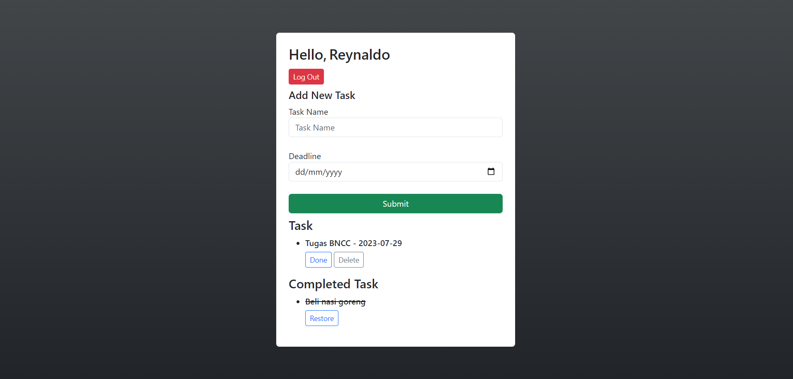

# To-do List





## Information

To-do list web page using PHP and SQL as a database for storing user account and each user task.

Members:

1. Reynaldo Marchell Bagas Adji
2. Reynaldy Marchell Bagas Adji

## Deploy

1. Download XAMPP on your system then run Apache and MySQL services
2. Open terminal and go to htdocs on your XAMPP directory

```bash
    cd C:\xampp\htdocs
```

3. Clone this repository

```bash
    git clone https://github.com/reynaldomarchell/MidProject-BackendDevelopment-2022.git todo
    cd todo
```

4. Copy the SQL query inside dbcode.sql after running this command

```bash
    cat database.sql
```

5. Go to this link (http://localhost/todo) to access the page.
